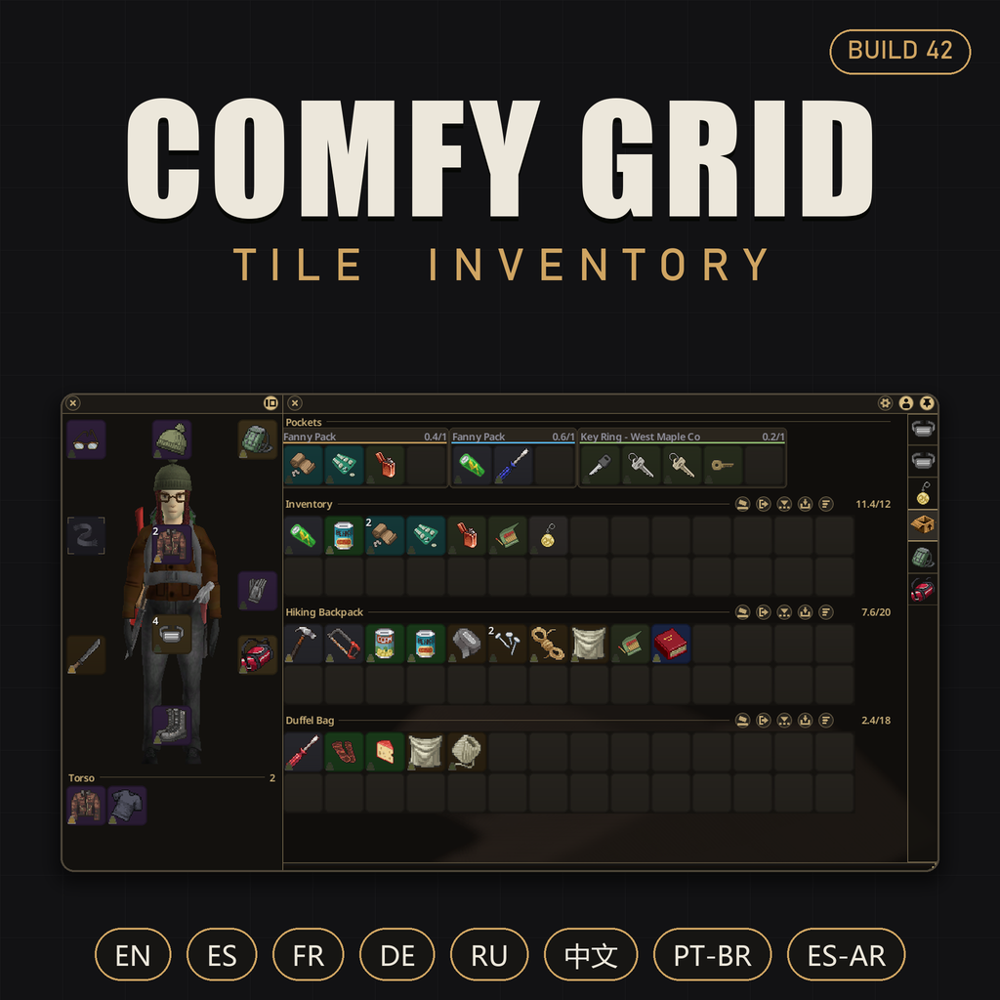
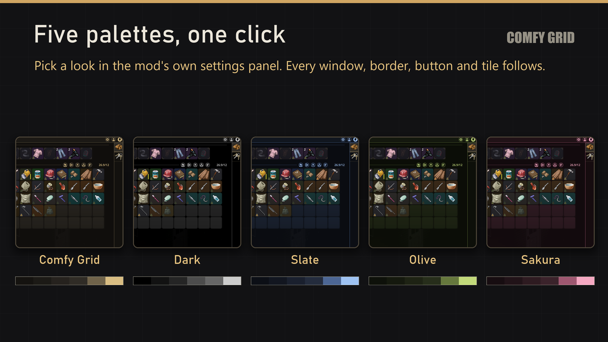

# Comfy Grid — Tile Inventory [B42]

Project Zomboid's list inventory, rebuilt as a grid of square tiles. Made for Build 42.

## The grid

- **Square tiles** that reflow to your window width — no more scrolling a text list.
- **Auto-stacking** — identical items share one tile with a counter whatever their state (fresh and stale food, a full and a half-used roll of tape); weapons, tools and heavy gear keep a tile of their own, while throwables pile up. An option restores strict grouping by state.
- **Status at a glance** — a colour bar for freshness, condition, uses and fluid; rounds on guns and magazines; reading progress on books; a weight icon that reddens with the load; and a torn red cross over anything broken. The bar can be switched off.
- **Marks that answer a question** — a star on your favourites, a tick on what you have already read, and the volume number on a skill book, dimmed while your level is too low to read it.
- **Stack inspector** — left-click a stack to see every item on its own, and drag one onto another to top it up.

## Every container, one window

- **Sections** — your pockets, every worn bag and every container within reach, stacked in one panel. No tabs.
- **Verbs on every header** — sort into category islands, pull in more of the same, spread across the open containers, send the lot over, or tip it on the floor.
- **The object's own buttons too** — ovens, washers, campfires, mannequins and car boots put their controls right on their header.
- **Reorder** — drag a container button to move it.
- **Open a bag on the spot** — a backpack you are carrying opens in its own small window, without putting it on.

## Your character

- **Equipment window** — docked beside the inventory, with a live 3D character and every socket on the body part it dresses. Or a flat silhouette, or a row inside the inventory.
- **Layer drawer** — click a socket to see everything you wear on that zone.
- **The hotbar, redressed** — the bar at the bottom of the screen wears the same tiles, and an empty slot shows what belongs in it.

## Controls

- **Drag** to move or swap; **Ctrl+click** or **Ctrl+drag** to multi-select; **Shift+click** quick-moves; hold a drag over a container to open it.
- **Pick your own gestures** — what moves an item (Shift, Ctrl, Alt or a double click) and what marks several tiles (Ctrl, Shift or Alt) are both yours to choose.
- **Drop to use** — rounds onto a magazine, a magazine or sight onto its gun, a bottle onto another to pour, a half-used item onto its twin to combine. Right-click *Pour into* does it from any container.
- **E** over gear equips it; if the socket is taken, they swap. It also eats, drinks, opens, smokes and reads — and takes only the portion you need.
- **Rebind that key from the inventory itself**, combinations included.
- **Full controller support** — a cell cursor over every surface, one button per action, on-screen hints, stack splitting from the inspector. The stack viewer, the bag window and the mod's own settings panel all answer the pad. Steam Deck friendly.

## Set up in game

The gear in the title bar opens the mod's own panel, **split into tabs**: **five colour themes** — Comfy Grid, Dark, Slate, Olive and Sakura — plus interface scale, grid density, stacking by type or state, instant transfers, and where the equipment lives. The equipment and the on-screen hotbar can be turned off altogether. Every option applies live, and a tooltip says what it does.

**Full multiplayer support**, and 8 languages: English, Español, Español (AR), Français, Deutsch, Русский, 简体中文, Português (BR).

Heads up: it replaces the vanilla inventory windows, so don't run it with Inventory Tetris or CleanUI — they replace the same UI. The mod warns you if it finds one.

## Install

Copy the [`ComfyGrid/`](ComfyGrid/) folder into `%USERPROFILE%\Zomboid\mods\` and enable it in-game, or subscribe on the [Steam Workshop](https://steamcommunity.com/sharedfiles/filedetails/?id=3772457854).

## About this repository

This is the released source of the mod: one commit per published version, with the development tooling stripped out. The cards used on the Workshop page live in [`workshop/`](workshop/).

## License

All rights reserved — see [LICENSE](LICENSE). In short: read and learn from the code all you want, but don't reupload the mod or its assets. Ports, patches and translations are welcome — ask first and credit the original.

— [Darkeng](https://github.com/darkeng) · [Steam](https://steamcommunity.com/id/_darkeng_)
